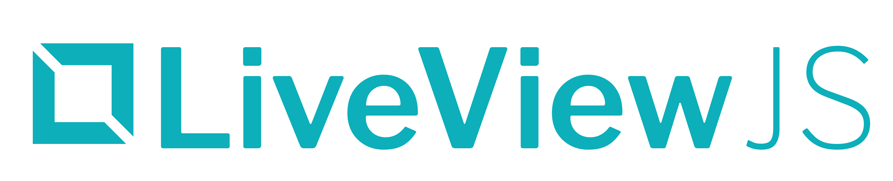

## LiveViewJS

*An HTML-first, "Get Stuff Done"-focused library for building LiveViews in NodeJS and Deno*

Learn more at [LiveViewJS.com](https://www.liveviewjs.com)

## Project direction

LiveViewJS is working toward compatibility with the latest stable Phoenix
LiveView protocol and browser client, with an equivalent, idiomatic developer
experience for TypeScript and JavaScript.

- [Roadmap and definition of done](docs/roadmap/README.md)
- [Phoenix LiveView compatibility baseline](compatibility/liveview.json)
- [Capability parity ledger](docs/roadmap/capabilities.md)
- [Verification-first architecture decision](docs/architecture/verification-first-parity.md)
