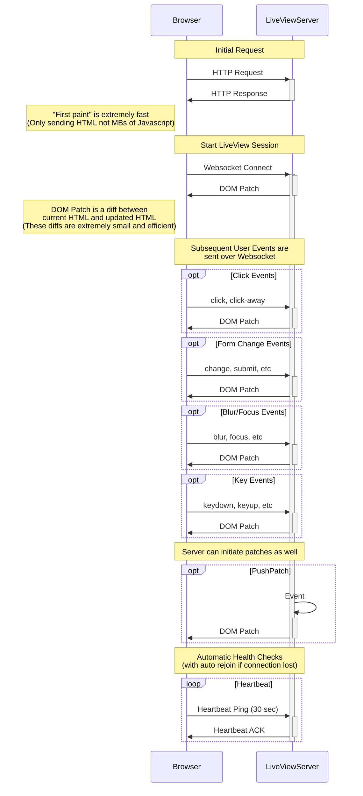

## LiveViewJS Client / Server Lifecycle

Below is a diagram of the lifecycle between a LiveViewJS client and server.

```mermaid
sequenceDiagram
    participant B as Browser
    participant S as LiveViewServer

    Note over B,S: Initial Request
    B->>+S: HTTP Request
    S->>-B: HTTP Response
    Note left of B: "First paint" is extremely fast<br /> (Only sending HTML not MBs of Javascript)

    Note over S,B: Start LiveView Session
    B->>+S: Websocket Connect
    activate S
    S->>-B: DOM Patch
    Note left of B: DOM Patch is a diff between<br /> current HTML and updated HTML<br />(These diffs are extremely small and efficient)

    Note over S,B: Subsequent User Events are<br /> sent over Websocket
    opt Click Events
        B->>+S: click, click-away
        S->>-B: DOM Patch
    end

    opt Form Change Events
        B->>+S: change, submit, etc
        S->>-B: DOM Patch
    end

    opt Blur/Focus Events
        B->>+S: blur, focus, etc
        S->>-B: DOM Patch
    end

    opt Key Events
        B->>+S: keydown, keyup, etc
        S->>-B: DOM Patch
    end

    Note over S,B: Server can initiate patches as well
    opt PushPatch
        S->>+S:  Event
        S->>-B: DOM Patch
    end

    Note over S,B: Automatic Health Checks <br />(with auto rejoin if connection lost)
    loop Heartbeat
        B->>+S: Heartbeat Ping (30 sec)
        S->>-B: Heartbeat ACK
    end
    deactivate S
```