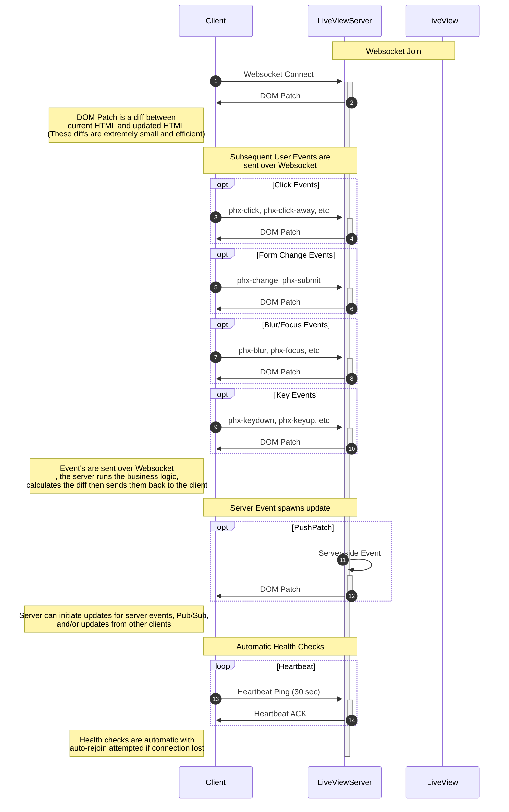
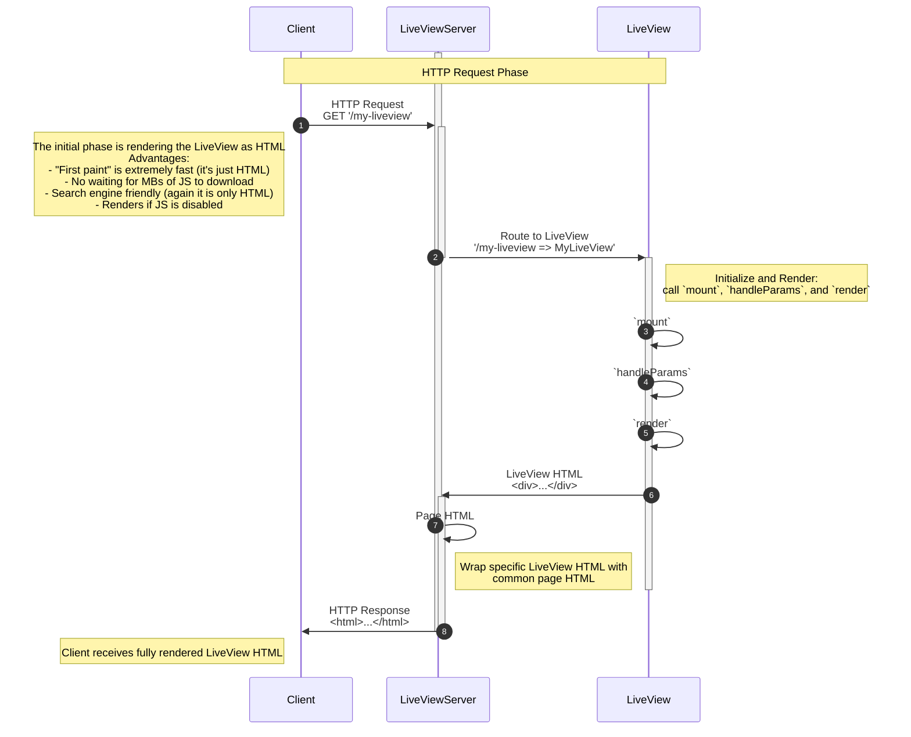
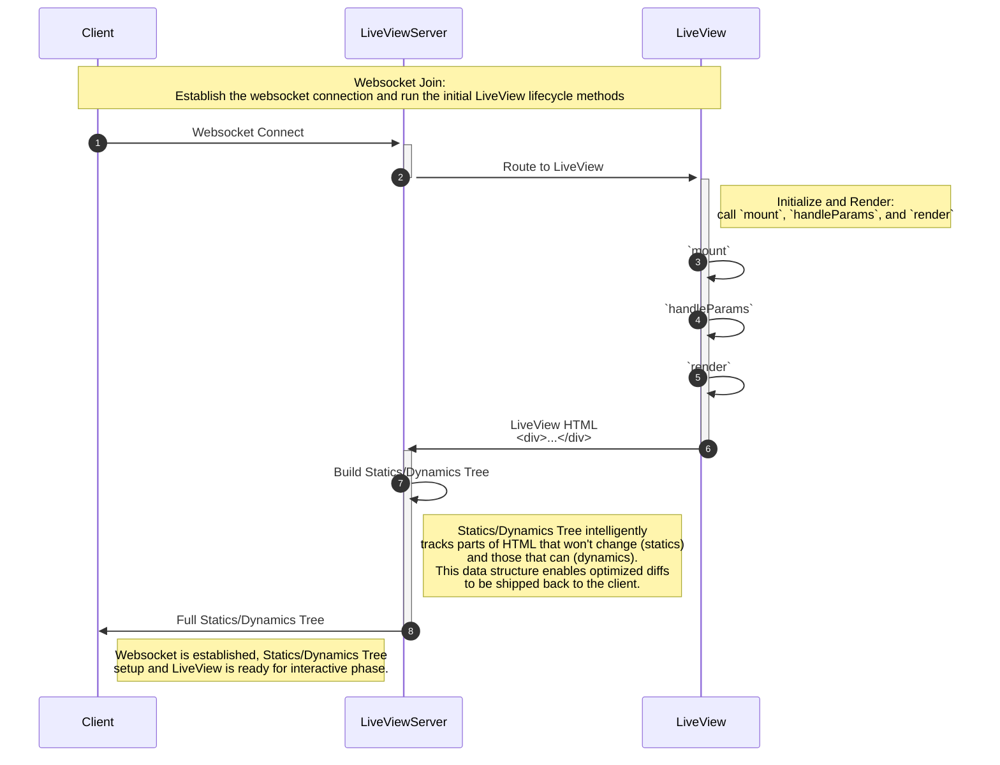
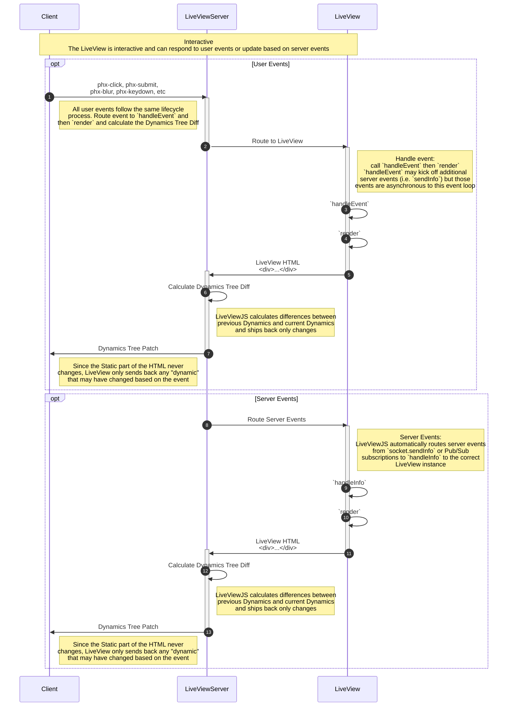
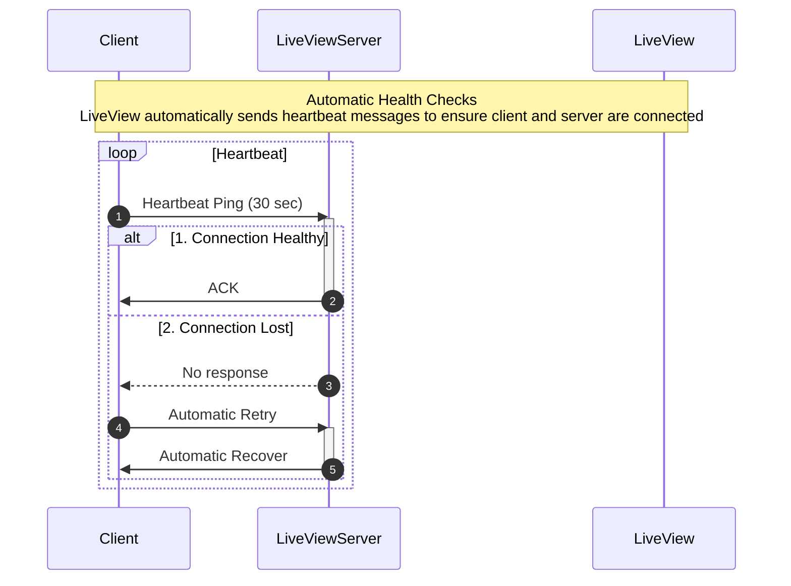
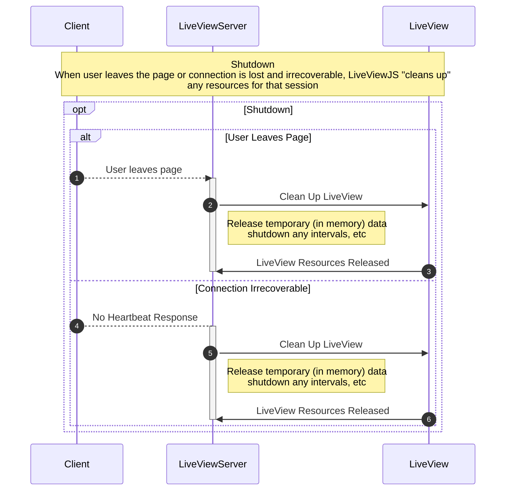

## LiveViewJS Client / Server Lifecycle

Below is a diagram of the lifecycle between a LiveViewJS client and server.


```mermaid
sequenceDiagram
    participant B as Client
    participant S as LiveViewServer

    Note over B,S: Initial Request
    rect rgb(191, 223, 255)
    B->>+S: HTTP Request
    S->>-B: HTTP Response
    Note left of B: "First paint" is extremely fast<br /> (Only sending HTML not MBs of Javascript)

    Note over S,B: Websocket Session
    B->>+S: Websocket Connect
    activate S
    S->>-B: DOM Patch
    Note left of B: DOM Patch is a diff between<br /> current HTML and updated HTML<br />(These diffs are extremely small and efficient)

    Note over S,B: Subsequent User Events are<br /> sent over Websocket
    opt Click Events
        B->>+S: phx-click, phx-click-away, etc
        S->>-B: DOM Patch
    end

    opt Form Change Events
        B->>+S: phx-change, phx-submit
        S->>-B: DOM Patch
    end

    opt Blur/Focus Events
        B->>+S: phx-blur, phx-focus, etc
        S->>-B: DOM Patch
    end

    opt Key Events
        B->>+S: phx-keydown, phx-keyup, etc
        S->>-B: DOM Patch
    end
    Note left of B: Event's are sent over Websocket,<br /> the server runs the business logic,<br /> calculates the diff then sends them back to the client

    Note over S,B: Server Event spawns update
    opt PushPatch
        S->>+S: Server-side Event
        S->>-B: DOM Patch
    end    
    Note left of B: Server can initiate updates for server events, Pub/Sub,<br /> and/or updates from other clients

    Note over S,B: Automatic Health Checks
    loop Heartbeat
        B->>+S: Heartbeat Ping (30 sec)
        S->>-B: Heartbeat ACK
    end
    Note left of B: Health checks are automatic with<br /> auto-rejoin attempted if connection lost
    deactivate S
```


OLD



## Initial HTTP Request


Websocket Join


User and Server Events


Heartbeat


Shutdown



All Webseocket
```mermaid
sequenceDiagram
    autonumber
    participant B as Client
    participant S as LiveViewServer
    participant L as LiveView    
    Note over B,L: Websocket Join:<br />Establish the websocket connection and run the initial LiveView lifecycle methods
    B->>+S: Websocket Connect
    activate S    
    S->>+L: Route to LiveView
    deactivate S
    Note right of L: Initialize and Render:<br />call `mount`, `handleParams`, and `render`
    L->>L: `mount` 
    L->>L: `handleParams` 
    L->>L: `render`
    L->>+S: LiveView HTML<br /><div>...</div>
    S->>S: Build Statics/Dynamics Tree
    Note right of S: Statics/Dynamics Tree intelligently<br />tracks parts of HTML that won't change (statics)<br />and those that can (dynamics).<br />This data structure enables optimized diffs<br />to be shipped back to the client.
    S->>-B: Full Statics/Dynamics Tree
    Note right of B: Websocket is established, Statics/Dynamics Tree<br />setup and LiveView is ready for interactive phase.

    Note over B,L: Interactive<br />The LiveView is interactive and can respond to user events or update based on server events
    opt User Events
        B->>+S: phx-click, phx-submit,<br />phx-blur, phx-keydown, etc
        Note right of B: All user events follow the same lifecycle<br /> process. Route event to `handleEvent` and<br /> then `render` and calculate the Dynamics Tree Diff
        S->>+L: Route to LiveView
        Note right of L: Handle event:<br />call `handleEvent` then `render`<br />`handleEvent` may kick off additional<br />server events (i.e. `sendInfo`) but those<br />events are asynchronous to this event loop
        L->>L: `handleEvent`
        L->>L: `render`
        L->>+S: LiveView HTML<br /><div>...</div>
        S->>S: Calculate Dynamics Tree Diff
        Note right of S: LiveViewJS calculates differences between<br />previous Dynamics and current Dynamics<br />and ships back only changes
        S->>-B: Dynamics Tree Patch
        Note right of B: Since the Static part of the HTML never<br /> changes, LiveView only sends back any "dynamic"<br /> that may have changed based on the event
    end

    opt Server Events
        Note right of L: Server Events:<br />LiveViewJS automatically routes server events<br />from `socket.sendInfo` or Pub/Sub<br />subscriptions to `handleInfo` to the correct<br />LiveView instance                
        L->>+L: `handleInfo`        
        L->>L: `render`
        L->>+S: LiveView HTML<br /><div>...</div>
        S->>S: Calculate Dynamics Tree Diff
        Note right of S: LiveViewJS calculates differences between<br />previous Dynamics and current Dynamics<br />and ships back only changes
        S->>-B: Dynamics Tree Patch
        Note right of B: Since the Static part of the HTML never<br /> changes, LiveView only sends back any "dynamic"<br /> that may have changed based on the event
    end


    Note over B,L: Automatic Health Checks<br />LiveView automatically sends heartbeat messages to ensure client and server are connected
    loop Heartbeat
        B->>+S: Heartbeat Ping (30 sec)
        alt Healthy
            S->>+B: ACK
        else Connection Lost
            S-->>B: No response
            B->>S: Automatic Retry
            S->>B: Automatic Recover
        end
    end
    
    Note over B,L: Shutdown<br />When user leaves the page or connection is lost and irrecoverable, LiveViewJS "cleans up" <br />any resources for that session
    opt Shutdown        
        alt User Leaves Page
            B-->>+S: User leaves page
        else Connection Irrecoverable
            S-->B: No Heartbeat Response
        end 
        S->>L: Clean Up LiveView
        Note right of S: Release temporary (in memory) data<br />shutdown any intervals, etc
        L->>S: LiveView Resources Released
        
    end
    deactivate S
